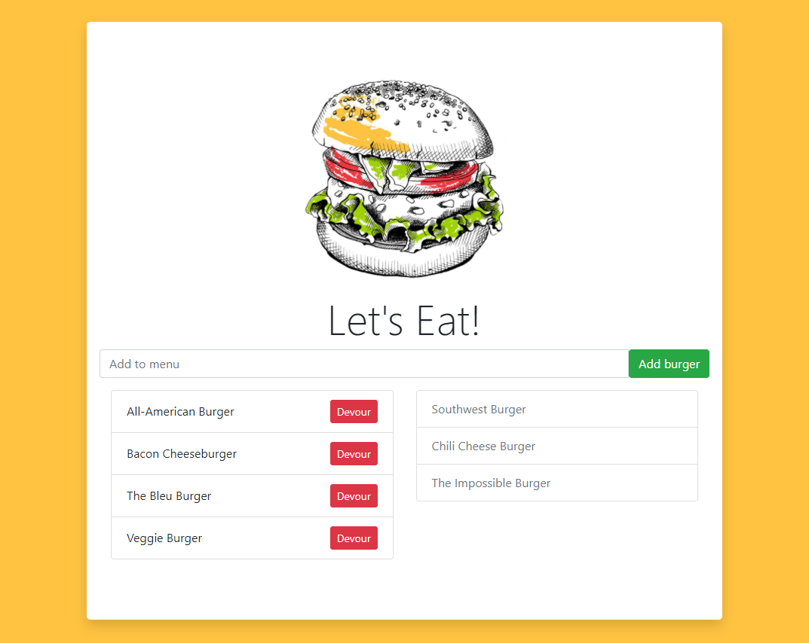

# Eat-Da-Burger!

## Description
In this repository you will find Eat-Da-Burger, a restaurant app that lets users input the names of burgers they'd like to eat. Whenever the user submits a burger's name, it will be displayed on the left side of the screen until it is devoured. Once devoured, it will be disabled and move to the right side of the page.

This application was built using MySQL, Node, Express, Handlebars, Bootstrap and a homemade ORM.

## Table of Contents
* [Installation](#installation)
* [Usage](#usage)
* [Contributing](#contributing)
* [Questions](#questions)
* [License](#license)


## Installation
To begin using this application, the user must first open the terminal. Next, the user must install all dependencies by running the following command:

```bash
npm install
```


## Usage
This application will be invoked by running the following command:

```bash
node server.js
```

For a more seamless experience, users are encouraged to [run the application online.](https://afternoon-brook-95200.herokuapp.com/)



[Watch a video walkthrough of the application.](https://drive.google.com/file/d/1nToUxMmQu12wsBK-qmJ5VfjP2udoIgXS/view)


## Contributing
* [Node.js](https://nodejs.org/en/)
* [Express](http://expressjs.com/)
* [MySQL](https://www.npmjs.com/package/mysql)
* [Handlebars](https://handlebarsjs.com/)
* [Bootstrap](https://getbootstrap.com/)
* [Shields.io](https://shields.io/)


## Questions
Find [jaccihorvath on GitHub](https://github.com/jaccihorvath) or email [jacci@gmail.com](mailto:jacci@gmail.com) with additional questions.


## License
Copyright (c) [jaccihorvath](https://github.com/jaccihorvath).
Licensed under the MIT License.
